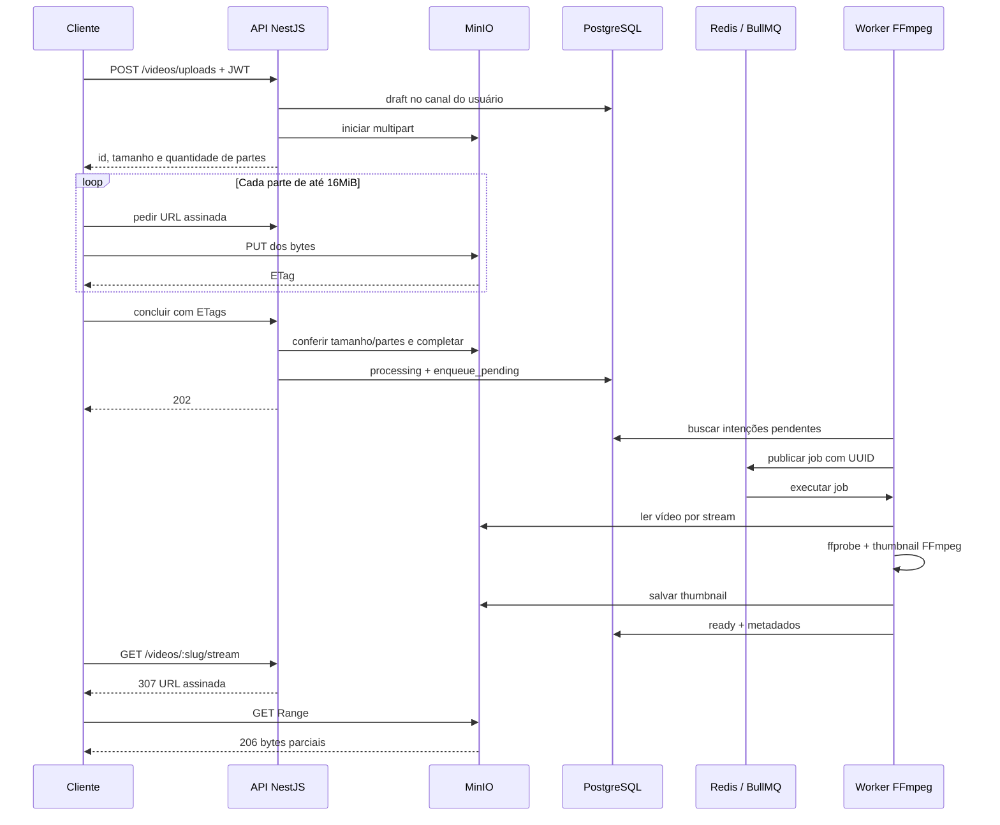

# StreamTube — fase 03: vídeos

A API recebe metadados, o cliente envia partes diretamente ao MinIO e um worker separado processa o arquivo com FFmpeg. O vídeo fica público somente depois de pronto. A base oficial das fases 01/02 foi preservada; esta entrega não modifica a interface.



## Executar localmente

Requisitos: Docker Compose e disco livre maior que o vídeo, além das imagens e volumes. Dentro de `nestjs-project`:

```sh
docker compose up -d --build
curl http://localhost:53000
```

A imagem instala o lockfile com `npm ci`; a API compila, aplica migrations e inicia. O worker aguarda a API saudável. API: http://localhost:53000; console MinIO: http://localhost:59001; Mailpit: http://localhost:58025. As credenciais literais do Compose são apenas do ambiente local didático. Não use esse Compose como configuração de produção.

Cadastre-se por `POST /auth/register`, confirme pelo link recebido no Mailpit e faça login em `POST /auth/login`. O cadastro cria seu canal. Use o `access_token` retornado, sem gravá-lo no repositório. O cliente abaixo requer somente Python 3 no host; todo desenvolvimento e teste Node continua dentro do Docker:

```sh
read -s STREAMTUBE_TOKEN
export STREAMTUBE_TOKEN
python3 scripts/upload-video.py /caminho/video.mp4 --title "Minha primeira aula"
unset STREAMTUBE_TOKEN
```

O cliente guarda no máximo uma parte de 16MiB em RAM. Em respostas 429, repete até cinco vezes respeitando `Retry-After` ou usando backoff. Assinaturas têm limite de 720/minuto e consultas de status de 120/minuto por usuário autenticado. Em falha de rede, o ID já criado é exibido; use a API para renovar assinaturas ou cancelar o rascunho com `DELETE /videos/:id/upload`. O cliente de exemplo não persiste sessão de retomada em disco.

`S3_ENDPOINT=http://storage:9000` é o endereço interno dos serviços. `S3_PUBLIC_ENDPOINT=http://localhost:59000` gera links para o cliente no host. Em outra máquina, configure um endereço público alcançável; não substitua o hostname de uma URL já assinada. Os e2e executam dentro da rede Docker e usam `storage:9000` como endpoint público apenas naquele processo de teste.

## Contratos e limites

[Plano e contratos](phase-03-videos.md), [decisões](../../decisions/technical-decisions-phase-03-videos.md), [evidências](progress.md) e [fontes](library-refs.md).

O limite de 10GB foi interpretado como 10GiB (10.737.418.240 bytes): até 640 partes de 16MiB. O servidor confere tamanho e ETag de cada parte real antes de concluir. MP4, WebM e MOV são aceitos; reprodução no navegador depende do codec original. Não há transcodificação adaptativa nesta fase. Download preserva os bytes originais. Links assinados expiram em 15 minutos; obtenha novo link para sessões mais longas.

O worker usa disco temporário, concorrência 1, até três tentativas e remove temporários no fim. Redis usa AOF e a intenção de fila persiste no PostgreSQL. Falhas terminais são reconciliadas também quando BullMQ não chama o processador ou o evento é perdido durante reinício. A atualização para erro é condicionada ao estado processing, preservando ready. Jobs têm ID do vídeo; a conclusão é idempotente e vídeos prontos não são reprocessados. Uploads abandonados continuam em draft até cancelamento; a política de expiração automática de multipart deve ser definida para operação prolongada.

## Verificação

Os testes de migrations recriam somente o banco local dedicado do Compose; não aponte essas variáveis para um banco com dados que deseja preservar.

```sh
docker compose stop video-worker
docker compose exec -T nestjs-api npm test -- --runInBand
docker compose start video-worker
docker compose exec -T nestjs-api npm run test:e2e -- --runInBand
docker compose exec -T nestjs-api npx tsc --noEmit
docker compose exec -T nestjs-api npm run lint
docker compose exec -T nestjs-api npm run build
python3 -m unittest discover -s scripts -p test_upload_video.py -v
```

Para parar preservando os dados: `docker compose stop`. A feature é `feature/sdd-fase-296`; uma PR deve visar `dev`. Não houve merge nem envio à plataforma.
